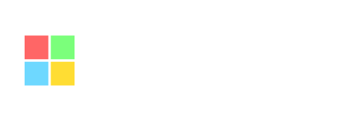
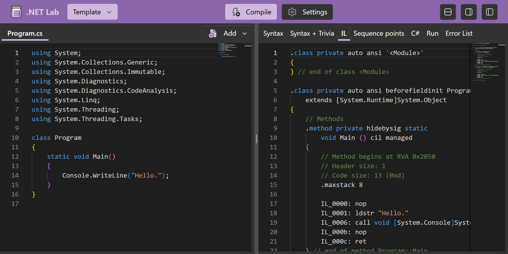
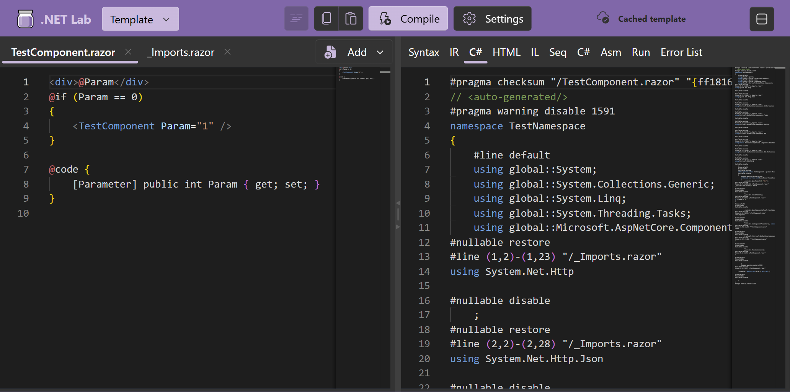

# .NET Lab

<sup>(aka Razor Lab, formerly also DotNetInternals)</sup>

C# and Razor compiler playground.
<br/>In the browser via Blazor WebAssembly. https://lab.razor.fyi/
<br/>Desktop app on [Windows Store](https://apps.microsoft.com/detail/9PCPMM329DZT) (full .NET, best performance).

<table><tr>
<td><a href="https://github.com/jjonescz/DotNetLab"></a></td>
<td><a href="https://apps.microsoft.com/detail/9PCPMM329DZT"></a></td>
<td><a href="https://lab.razor.fyi/"></a></td>
</tr></table>

| [C#](https://lab.razor.fyi/#csharp) | [Razor](https://lab.razor.fyi/#razor) |
|:-:|:-:|
|  |  |

## Features

- Razor/CSHTML to generated C# code / IR / Syntax Tree / Errors.
- C# to IL / Syntax / IOperation / Symbols / decompiled-C# / JIT Asm / Errors / Execution console output.
- Any Roslyn/Razor compiler version (NuGet official builds or CI builds given PR number / branch / build number).
- Offline support: PWA or Windows desktop native app.
- VSCode Monaco Editor.
- Multiple input sources (especially useful for interlinked Razor components).
- C# Language Services (completions, live diagnostics, code fixes).
- Configuring any C# options (e.g., LangVersion, Features, OptimizationLevel, AllowUnsafe)
  via Roslyn C# APIs or via `#:property` directives (both with editor completions).
- Referencing NuGet packages via `#:package` directives.

## Development

For prerequisites, see `eng/build.sh` (in short: you need .NET SDK according to `global.json`
and workloads `wasm-tools wasm-experimental`).

The recommended startup app for development is `src/Server`.

To hit breakpoints, it is recommended to turn off the worker (in app settings).

- `eng/BuildTools`: build-time tools.
- `src/App`: the core app.
- `src/Compiler`: self-contained project referencing Roslyn/Razor.
  It's reloaded at runtime with a user-chosen version of Roslyn/Razor.
  It should be small (for best reloading perf). It can reference shared code
  which does not depend on Roslyn/Razor from elsewhere (e.g., `Shared.csproj`).
- `src/RazorAccess`: `internal` access to Razor DLLs (via fake assembly name).
- `src/RoslynAccess`: `internal` access to Roslyn Compiler DLLs (via fake assembly name).
- `src/RoslynCodeStyleAccess`: `internal` access to Roslyn CodeStyle DLLs (via fake assembly name).
- `src/RoslynWorkspaceAccess`: `internal` access to Roslyn Workspace DLLs (via fake assembly name).
- `src/Server`: a Blazor Server entrypoint for easier development of the App
  (it has better tooling support for hot reload and debugging).
- `src/Shared`: code used by `Compiler` that does not depend on Roslyn/Razor.
- `src/WebAssembly`: web-assembly host of the `App` (this is what's deployed online).
  - Trying out published version locally:
    ```ps1
    dotnet tool restore
    dotnet workload restore
    dotnet publish ./src/WebAssembly/ && dotnet serve -d ./artifacts/publish/WebAssembly/release/wwwroot/ -o -q
    ```
- `src/Worker`: a separate component that can be loaded in a web worker (a separate process in the browser),
  so it does all the CPU-intensive work to avoid lagging the user interface.
- `src/WorkerApi`: shared code between `Worker` and `App`.
  This is in preparation for making the worker independent of the app,
  so the app can be optimized (trimming, NativeAOT) and the worker can be loaded more lazily.
- `src/WorkerWebAssembly`: web-assembly host of the `Worker`.
- `test/UnitTests`

## Attribution

- Logo: [OpenMoji](https://openmoji.org/library/emoji-1FAD9-200D-1F7EA/)
- Style: [Fluent UI](https://www.fluentui-blazor.net/)
- Icons: [Fluent UI Icons](https://github.com/microsoft/fluentui-system-icons)

## Related work

Razor REPLs:
- https://blazorrepl.telerik.com/
- https://netcorerepl.telerik.com/
- https://try.mudblazor.com/snippet
- https://blazorfiddle.com/
- https://try.fluentui-blazor.net/snippet

C# REPLs:
- https://dotnetfiddle.net/
- https://onecompiler.com/csharp
- https://www.programiz.com/csharp-programming/online-compiler/

C# compiler playgrounds:
- https://sharplab.io/
- https://godbolt.org/

XAML REPLs:
- https://playground.platform.uno/

Web IDEs:
- https://github.com/Mythetech/Apollo
- https://github.com/Luthetus/Luthetus.Ide
- https://github.com/knervous/intellisage
